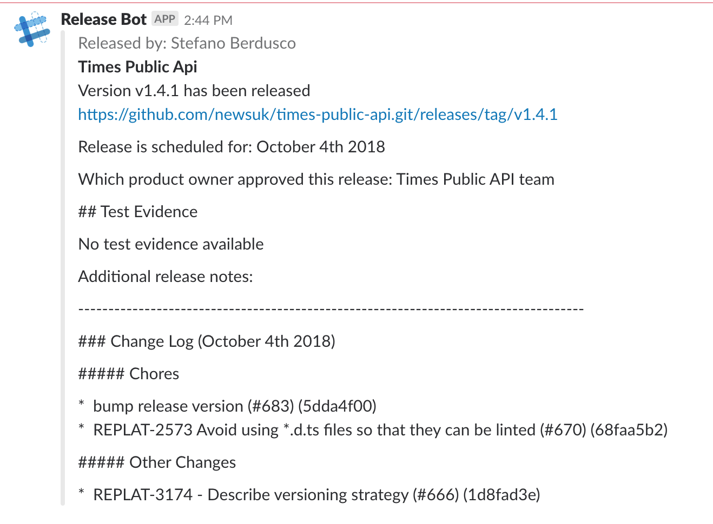
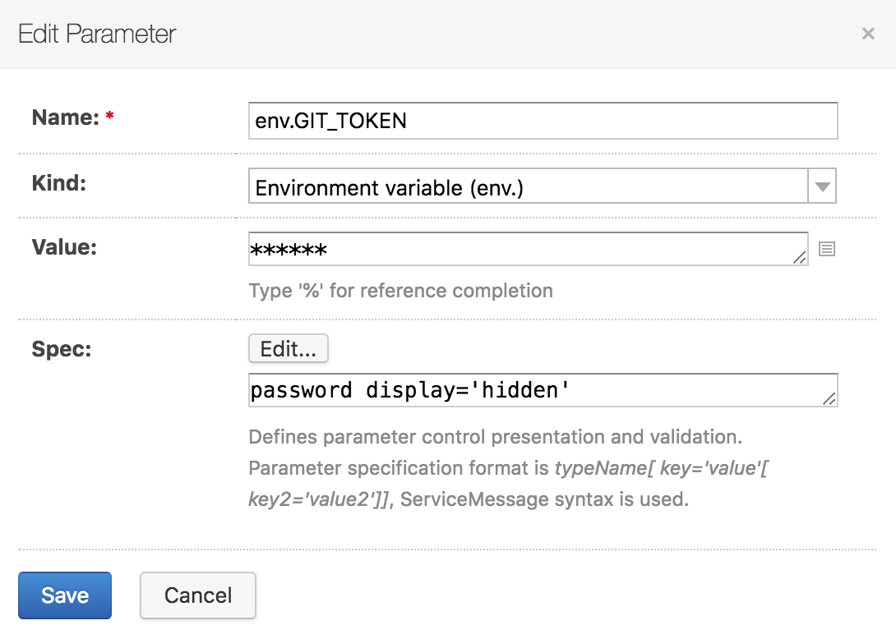

# Times Release Notifications

This repository contains scripts to enable Slack notifications around
deployments of releases. This is what powers the Release Bot in
`#digital-releases`.

Example notification:



## Usage

Within TeamCity (or other CI tool of your choice), create a script step after
deployment has been completed which calls the following:

```
curl -sSL https://raw.githubusercontent.com/newsuk/times-release-notifications/master/slackbot.sh | bash -s
```

You also need to ensure the following environment variables are set up:

- `GIT_REPO_URL` - The git repository URL (e.g. `git@github.com:newsuk/project.git`)
- `GIT_HASH` - The commit hash of the build, must be tagged!
- `PROJECT_NAME` - The project name
- `RELEASED_BY` - The name of the user who released
- `SLACK_URL_RELEASE` - The slack webhook url for the appropriate channel to post to

Times Release Notification uses git api to retrieve the release notes. If your github repo is private you also need to ensure the following additional environment variable is set

- `RELEASE_BOT_TOKEN` - The access token in order to access github api on a private repo

More information about git access token [here](https://help.github.com/articles/creating-a-personal-access-token-for-the-command-line/)

Additional commandline options:
```
./slackbot.sh
	-h --help
	Prints this help

	--git-repo-url
	The git repository URL (e.g. git@github.com:newsuk/project.git)

	--git-hash
	The commit hash of the build, must be tagged!

	--project-name
	The project name

	--released-by
	The user who released

	--slack-url-release
	The slack webhook url for the appropriate channel to post to

	--release
	Changes the github release status from prerelease to release

```

### TeamCity

For TeamCity, use the following as a guide on how to set up the environment
variables.

These will vary from project to project:

```
GIT_REPO_URL      %dep.<Project>.vcsroot.url%
GIT_HASH          %dep.<Project>.build.vcs.number%
PROJECT_NAME      %dep.<Project>.system.teamcity.projectName%
RELEASED_BY       %teamcity.build.triggeredBy%
```

NOTE: If you configure `RELEASE_BOT_TOKEN` please note this is equivalent to a github passwords. When you set up the environment variable in TeamCity make sure it it set as display "hidden" and type "password"



### Slack Webhook URL

From the Slack "Release Bot" app, the webhook URL can be found (or created) for
the appropriate channel within the "Incoming Webhooks" section. There should
be one URL per channel which notifications will be sent to.
