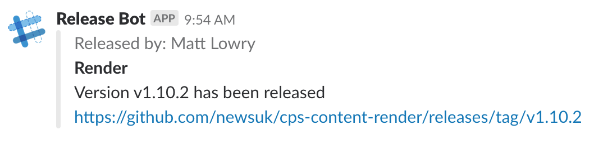

# Times Release Notifications

This repository contains scripts to enable Slack notifications around
deployments of releases.  This is what powers the Release Bot in
`#digital-releases`.

Example notification:




## Usage

Within TeamCity (or other CI tool of your choice), create a script step after
deployment has been completed which calls the following:

```
curl -sSL https://raw.githubusercontent.com/newsuk/times-release-notifications/master/slackbot.sh | bash -s
```

You also need to ensure the following environment variables are set up:

* `GIT_REPO_URL` - The git repository URL (e.g. `git@github.com:newsuk/project.git`)
* `GIT_HASH` - The commit hash of the build, must be tagged!
* `PROJECT_NAME` - The project name
* `RELEASED_BY` - The user who released
* `SLACK_WEBHOOK_URL` - The slack webhook url for the appropriate channel to post to


### TeamCity

For TeamCity, use the following as a guide to how to set up the environment
variables.  This will vary from project to project.

```
GIT_REPO_URL      %dep.<Project>.vcsroot.url%
GIT_HASH          %dep.<Project>.build.vcs.number%
PROJECT_NAME      %dep.<Project>.system.teamcity.projectName%
RELEASED_BY       %teamcity.build.triggeredBy%
```


### Slack Webhook URL

From the Slack "Release Bot" app, the webhook URL can be found (or created) for
the appropriate channel within the "Incoming Webhooks" section.  There should
be one URL per channel which notifications will be sent to.
